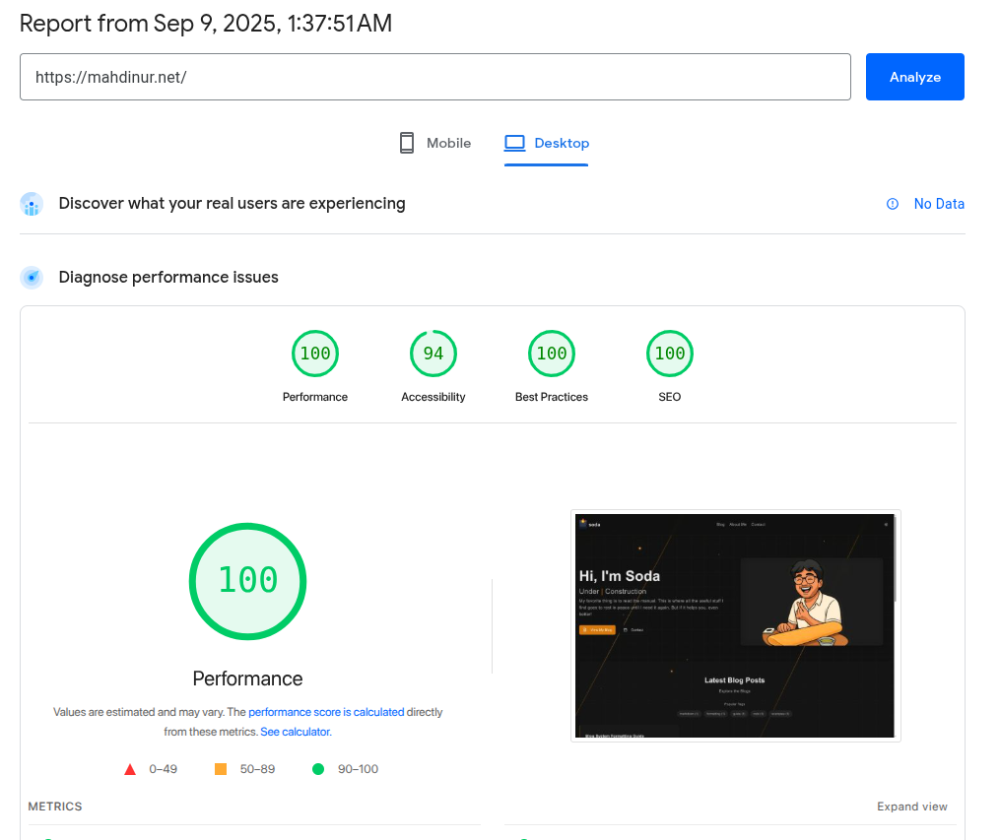
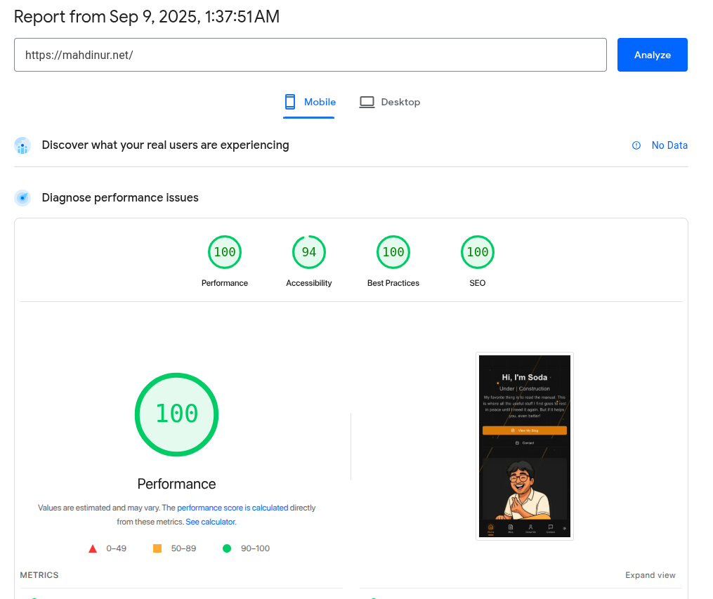

# Personal Website

A simple portfolio website built with Astro, React, and Tailwind CSS.

## 🚀 Quick Start

### Prerequisites

- [Bun](https://bun.sh/) (recommended) or Node.js 18+

### Installation

```bash
# Install dependencies
bun install
# or npm install
```

### Development

```bash
# Start development server
bun run dev

# Open http://localhost:4321 in your browser
```

### Build & Deploy

```bash
# Build for production
bun run build

# Deploy to Cloudflare Workers
bun run deploy
```

# ✨ Features

## 📚 Blog System with MDX
- MDX support with embedded React components
- Auto tagging and featured posts
- Rich content with images and code blocks

## 🔍 Full-Text Search
- Real-time search with highlighting
- Tag filtering and search analytics

## 💬 Anonymous Contact Form
- Backend to view message (Very simple)
- Public message display with animations
- Backend message management

## 🏠 Auto Homepage Compilation
- Recent posts automatically displayed
- Featured content with hero images

## 📱 Asset Management
- Auto image optimization in `src/assets/`
- WebP conversion and responsive sizing
- Lazy loading optimization

# ⚙️ Configuration

## Site Settings

You can customize your site's domain and other settings in `astro.config.mjs`:

- **Site URL**: Change `site: 'https://mahdinur.net'` to your domain
- **Contact API**: Update `contactApiUrl` to your backend URL
- **Themes**: Modify code syntax highlighting themes
- **Locales**: Add or change supported languages in the `i18n` section

### Key Configuration Options

```javascript
export default defineConfig({
  site: 'https://yourdomain.com',    // Your site URL
  // ... other settings
});

// Contact API configuration
export const contactApiUrl = 'https://your-api.domain.com';
```

## 📝 Adding Content

### Blog Posts

Create new blog posts in `src/features/blog/content/en/` as `.mdx` files:

```markdown
---
title: "Your Post Title"
description: "Brief description"
pubDate: 2025-01-01
tags: ['tag1', 'tag2']
featured: true
---

Your blog content with Markdown/MDX and React components...
```

### About Me

Edit your about section in `src/features/about-me/content/en/about-me.mdx`. Like blog posts, this is an MDX file where you can add rich content, React components, images, and multiple sections. It supports the same frontmatter structure as blog posts with title, description, tags, and hero images.

### Styling

Global styles and theme variables are defined in `src/styles/global.css`. This includes color schemes, animations, scrollbar styling, and the animated background effects. The site uses Tailwind CSS with custom CSS variables for theming.

## 🏃‍♂️ Contact Form Backend

The contact form uses a Python FastAPI backend (`contact-me.py`) that provides both API and CLI interfaces for managing anonymous messages. Features include:

- **Anonymous messaging** with unique keys for reply checking
- **Public/private message options** - users can choose to make messages publicly visible
- **Admin interface** with password authentication for managing messages
- **SQLite database** storage in `contact_messages.db`
- **Interactive CLI** with rich formatting and arrow-key navigation
- **CORS support** configured for your domain

### Setup

Set your admin password as an environment variable:
```bash
export CONTACT_ADMIN_PASSWORD=your_secure_password
```

Run the setup script to configure:
```bash
# Linux/Mac
./setup-contact.sh

# Windows  
setup-contact.bat
```

### API Endpoints

- `POST /api/contact/send-message` - Send anonymous messages
- `POST /api/contact/check-reply` - Check for replies using message key
- `GET /api/contact/public-messages` - Get public messages and replies
- Admin endpoints (require Bearer token authentication)

The backend starts both the API server and an interactive CLI for message management.

## ⚡ Performance

This website is very fast and lightweight, achieving perfect 100/100 PageSpeed scores on both desktop and mobile.

| Desktop | Mobile |
|---------|--------|
|  |  |

## 🛠️ Available Scripts

- `bun run dev` - Start development server  
- `bun run build` - Build for production
- `bun run preview` - Preview production build
- `bun run deploy` - Deploy to Cloudflare Workers
- `bun run format` - Format code with Prettier

## ☁️ Deployment

This website is configured for deployment to Cloudflare Workers using Wrangler. The `wrangler.json` configuration file handles static asset serving from the `dist` folder.

To deploy:
1. Build the project: `bun run build`
2. Deploy to Cloudflare: `bun run deploy`

On first deployment, you'll be prompted to authenticate with Cloudflare and create a new Workers project.